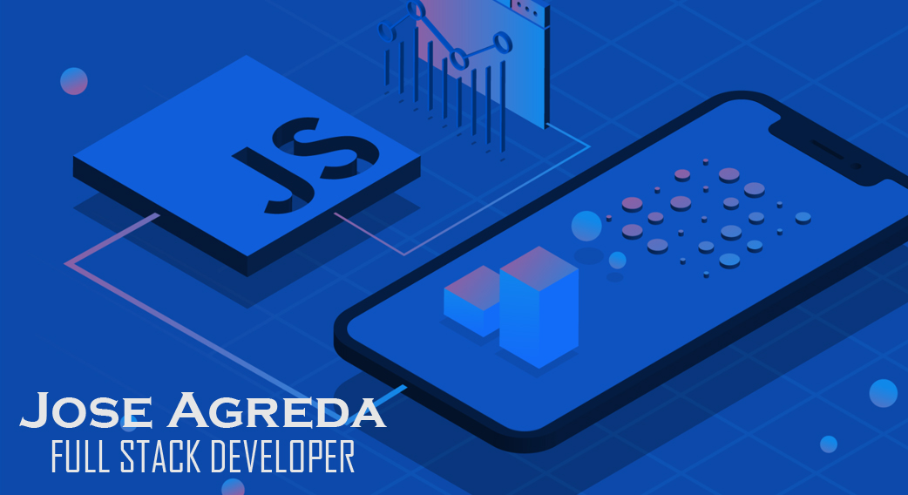

  

  <h1>Jose Leonardo Agreda Anchaise</h1>

  

    <strong>Full Stack Engineer</strong> focused on real-time systems, scalable backend architectures,
    and production AI platforms.
  

  Profile refreshed in 2026 based on recent production work.

  

    
    
    
  

## Profile

I build end-to-end web platforms with a strong backend focus: Node.js, TypeScript,
REST APIs, WebSockets, relational databases, and Linux-based production deployments.

My recent work includes conversational AI platforms, EdTech products, real-time
services, and cloud infrastructure on AWS, DigitalOcean, Nginx, SSL/Certbot, Docker,
and GitHub Actions.

Based in Rosario, Santa Fe, Argentina. Working remotely.

## Current Focus

<table>
  <tr>
    <td width="33%">
      <strong>Real-time systems</strong> 
      WebSockets, concurrent sessions, event-driven flows, latency optimization.
    </td>
    <td width="33%">
      <strong>Scalable backends</strong> 
      Node.js, TypeScript, NestJS, Express, REST APIs, authentication, clean architecture.
    </td>
    <td width="33%">
      <strong>Production delivery</strong> 
      Linux servers, cloud deployments, Nginx, SSL, CI/CD, monitoring-minded engineering.
    </td>
  </tr>
</table>

## Experience

| Period | Role | Scope |
| --- | --- | --- |
| Jul 2024 - Present | Full-Stack Engineer at OptiPixel | Production conversational AI platform, scalable backend services, WebSockets, external AI APIs, Linux/VPS deployments. |
| 2024 | Full-Stack Developer at Lum for School | AI-powered EdTech platform presented on Shark Tank Guatemala, React + Node.js, REST APIs, relational database modeling, cloud deployment. |
| 2022 | Tech Lead at Core Code | Backend architecture, technical leadership, code reviews, engineering practices. |
| 2021 - 2022 | Frontend Developer at MayLand Labs | React interfaces, external API integrations, authentication flows, Three.js experiences, performance work. |
| Ongoing | React & Node Bootcamp Instructor | Full stack mentoring, technical training, real-world case support. |

## Tech Stack

### Frontend

### Backend

### Data, Cloud & DevOps

## Selected Work

| Area | What I have built |
| --- | --- |
| Conversational AI | Production services that integrate AI models, external APIs, real-time messaging, and scalable backend workflows. |
| EdTech | AI-powered academic response platform with public launch and real-user validation. |
| Realtime apps | WebSocket-based systems supporting multiple concurrent sessions and low-latency interactions. |
| Cloud delivery | VPS/cloud deployments with Linux, Nginx, SSL, domain configuration, and production maintenance. |
| 3D web interfaces | React experiences with Three.js and performance-focused UI implementation. |

## Public Repositories

Recent production work is mostly private or company-owned. This profile is being refreshed so the public
repositories can better reflect current backend, AI, and real-time engineering work.

  
  

## GitHub Activity

  
  

