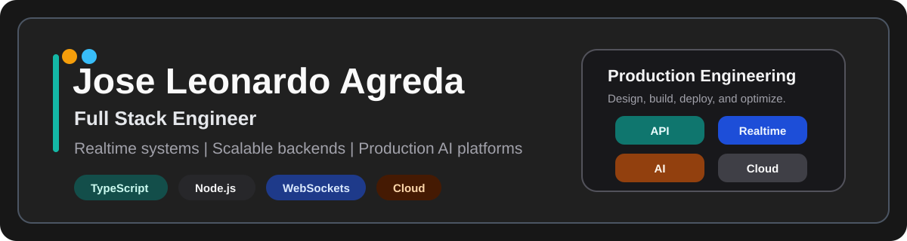
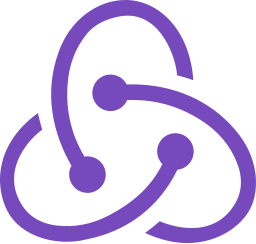
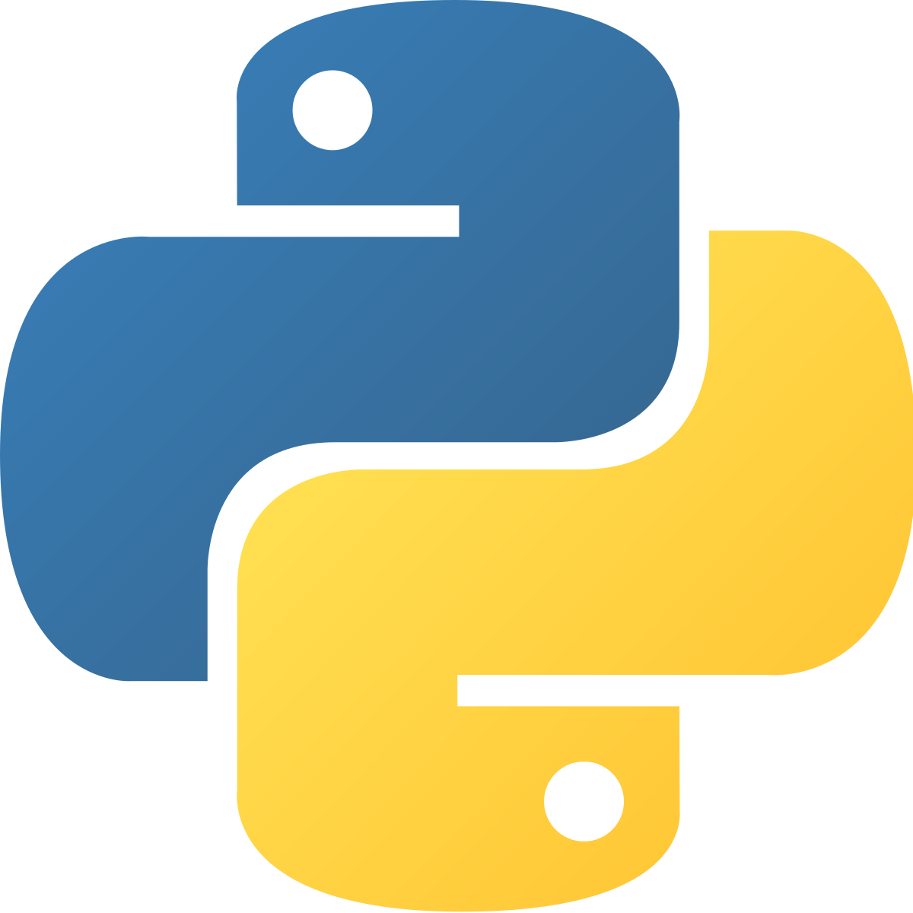
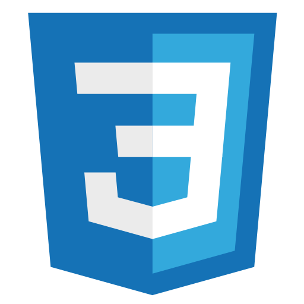

  

  <h1>Jose Leonardo Agreda Anchaise</h1>

  

    Full Stack Engineer focused on real-time systems, scalable backend architectures,
    and production AI platforms.
  

  

    <a href="mailto:joseleonardoagreda@gmail.com">Email</a>
    &nbsp;|&nbsp;
    <a href="https://www.linkedin.com/in/leonardoagreda/">LinkedIn</a>
    &nbsp;|&nbsp;
    <a href="https://github.com/Senjo903">GitHub</a>
  

## About

I build end-to-end web platforms with a strong backend focus: Node.js, TypeScript,
REST APIs, WebSockets, relational databases, and Linux-based production deployments.

My recent work includes conversational AI platforms, EdTech products, real-time
services, and cloud infrastructure on AWS, DigitalOcean, Nginx, SSL/Certbot,
Docker, and GitHub Actions.

Based in Rosario, Santa Fe, Argentina. Working remotely.

## What I Build

<table>
  <tr>
    <td width="33%">
      <strong>Realtime systems</strong> 
      WebSockets, concurrent sessions, event-driven flows, and latency optimization.
    </td>
    <td width="33%">
      <strong>Backend platforms</strong> 
      Node.js, TypeScript, NestJS, Express, REST APIs, authentication, and clean architecture.
    </td>
    <td width="33%">
      <strong>Production delivery</strong> 
      Linux servers, cloud deployments, Nginx, SSL, CI/CD, and performance-minded engineering.
    </td>
  </tr>
</table>

## Experience

| Period | Role | Scope |
| --- | --- | --- |
| Jul 2024 - 2026 | Full-Stack Engineer at OptiPixel | Production conversational AI platform, scalable backend services, WebSockets, external AI APIs, Linux/VPS deployments. |
| 2024 | Full-Stack Developer at Lum for School | AI-powered EdTech platform presented on Shark Tank Guatemala, React + Node.js, REST APIs, relational database modeling, cloud deployment. |
| 2022 | Tech Lead at Core Code | Backend architecture, technical leadership, code reviews, and engineering practices. |
| 2021 - 2022 | Frontend Developer at MayLand Labs | React interfaces, external API integrations, authentication flows, Three.js experiences, and performance work. |
| Ongoing | React & Node Bootcamp Instructor | Full stack mentoring, technical training, and real-world case support. |

## Stack

  <table>
    <tr>
      <td align="center" width="96">
         
        TypeScript
      </td>
      <td align="center" width="96">
         
        JavaScript
      </td>
      <td align="center" width="96">
         
        Node.js
      </td>
      <td align="center" width="96">
         
        React
      </td>
      <td align="center" width="96">
         
        Redux
      </td>
      <td align="center" width="96">
         
        Express
      </td>
    </tr>
    <tr>
      <td align="center" width="96">
         
        PostgreSQL
      </td>
      <td align="center" width="96">
         
        Sequelize
      </td>
      <td align="center" width="96">
         
        Python
      </td>
      <td align="center" width="96">
         
        Git
      </td>
      <td align="center" width="96">
         
        HTML5
      </td>
      <td align="center" width="96">
         
        CSS3
      </td>
    </tr>
  </table>

### Backend, Cloud & DevOps

`NestJS` `REST APIs` `WebSockets` `JWT` `TypeORM` `SQL` `AWS EC2`
`DigitalOcean` `Linux` `Nginx` `SSL/Certbot` `Docker` `GitHub Actions`

## Selected Work

| Area | What I have built |
| --- | --- |
| Conversational AI | Production services that integrate AI models, external APIs, real-time messaging, and scalable backend workflows. |
| EdTech | AI-powered academic response platform with public launch and real-user validation. |
| Realtime apps | WebSocket-based systems supporting multiple concurrent sessions and low-latency interactions. |
| Cloud delivery | VPS/cloud deployments with Linux, Nginx, SSL, domain configuration, and production maintenance. |
| 3D web interfaces | React experiences with Three.js and performance-focused UI implementation. |

## Public Repositories

Recent production work is mostly private or company-owned. This public profile is being
refreshed to better reflect current backend, AI, and real-time engineering work.

| Repository | Focus |
| --- | --- |
| [react-orillusion-client](https://github.com/Senjo903/react-orillusion-client) | React client work and interactive UI foundations. |
| [express-orillusion-server](https://github.com/Senjo903/express-orillusion-server) | Express backend work and server-side foundations. |
| [PI-Countries-FT14](https://github.com/Senjo903/PI-Countries-FT14) | Full stack bootcamp project with JavaScript, React, Node.js, and relational data. |

## Profile Status

This profile was refreshed in 2026 to replace the old visual layout and remove
external image dependencies that can fail in GitHub README rendering.
